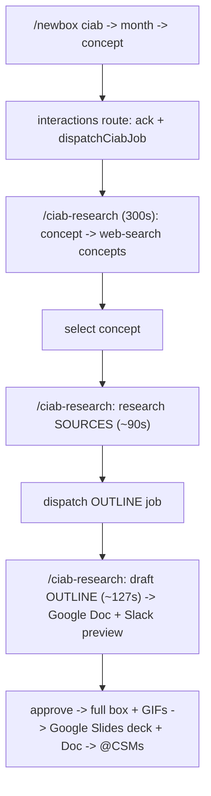

# Architecture

> Stable system structure. Update only when structure, data flow, or integrations change.

## Overview

**Box Studio (ciabv3)** is a Next.js 16 App Router app for building Living Security cybersecurity-awareness content. It produces two content products:

- **Mini Box** — a single-topic package (7-slide deck: cover, welcome, one-pager, chat + GIFs).
- **CIAB / "Main Box"** — a full monthly campaign (welcome + blog + 4 weekly emails + 4 weekly chats + resources; 20-slide deck).

It exposes **three surfaces** over the same content pipeline:

1. **Web builder** — ideate topics, edit section copy with optional Claude assistance, preview a PPTX live, and download a template-faithful deck.
2. **Slack bot** — an end-to-end `/newbox` workflow (research → concept → outline → full draft → CSM review → finalize) that posts results back to a Slack thread.
3. **Knowledge Base** — indexes a Google Drive archive for retrieval-grounded generation and Q&A, plus annual topic-calendar OCR.

**Stack:** Next.js 16.2.10 (App Router, Turbopack), React 19, TypeScript 5, Tailwind CSS 4, next-auth v5 (Google OAuth), Anthropic Claude (direct REST + server-side web search), `@libsql/client` (SQLite/Turso), `googleapis` (Drive/Docs/Slides), JSZip + fast-xml-parser + pptxgenjs (PPTX), pptx-viewer (preview), Giphy, Zod.

## Major Components

| Component | Path | Responsibility |
|-----------|------|----------------|
| App Router pages | `src/app/` | Dashboard, builder, knowledge, settings, login, setup |
| API routes | `src/app/api/` | AI, Giphy, PPTX, Drive, knowledge, annual-calendar, app-settings, Slack webhooks |
| Builder UI | `src/components/builder/` | Mini Box editor, live preview, review, GIF picker, model select |
| Layout shell | `src/components/layout/` | Sidebar, top bar, shell context |
| Document model | `src/lib/mini-box.ts`, `src/lib/ciab.ts` | Mini Box + CIAB section types, status, factories |
| Box persistence | `src/lib/box-store.ts` | localStorage CRUD for boxes |
| Anthropic client | `src/lib/anthropic.ts` | Claude REST calls (text/JSON/vision), web search, timeout + retry |
| Model registry | `src/lib/claude-models.ts` | Model IDs, legacy aliases, per-model capability flags |
| Generation | `src/lib/ciab-generate.ts`, `src/lib/mini-box-generate.ts`, `*-topic-research.ts` | Concept/source/outline/full-content generation |
| Slack integration | `src/lib/slack/*`, `src/app/api/webhooks/slack/*` | Webhooks, handlers, review flows, background jobs |
| PPTX export | `src/lib/pptx/*` | Template XML surgery + GIF injection (Mini Box + CIAB) |
| Google Drive | `src/lib/google-drive*.ts` | Folder browse, indexing, text export, Docs/Slides upload |
| Durable server store | `src/lib/box-studio-drive-data.ts` | App settings, drafts, workflow records as Drive JSON |
| Database | `src/lib/db/*` | libSQL: annual calendars, Slack thread↔workflow map, calendar waits |
| Knowledge retrieval | `src/lib/knowledge-retrieval.ts`, `knowledge-*.ts` | Archive indexing, retrieval, Q&A context |
| Auth | `src/lib/auth.ts` | Google OAuth (Drive/Slides scopes), JWT session |
| Master templates | `templates/*.pptx` | Mini Box (7-slide) + CIAB (20-slide) deck sources |

## Boundaries

- **In-app:** Mini Box + CIAB authoring, PPTX preview/export, Slack-driven generation workflow, KB indexing/Q&A, annual-calendar OCR.
- **Out of app:** Google Slides editing (decks are uploaded to Drive for review/comment), email/chat distribution, analytics (sidebar placeholder only).

## AI / Claude

- **Provider:** Anthropic Claude via direct REST (`https://api.anthropic.com/v1/messages`), `ANTHROPIC_API_KEY`. All calls degrade to mock data when the key is unset.
- **Models** (`src/lib/claude-models.ts`): default `claude-sonnet-4-6` (outline/full-content); `claude-opus-4-8` for topic/concept/source research (higher URL accuracy). Overridable via Drive app-settings (`claudeModel`) or `ANTHROPIC_MODEL` / `ANTHROPIC_TOPIC_MODEL`. `modelSupportsTemperature` omits `temperature` for Opus 4.8.
- **Web search:** Anthropic's server-side `web_search_20250305` tool, enabled per call (`webSearch: true`, bounded by `webSearchMaxUses`). Used for concept/source/topic research; results are URL-validated (`topic-source-validation.ts`) to prune dead links.
- **Resilience:** `anthropicFetch` applies a per-request timeout (240s default) + one retry on transient 429/5xx, so a stalled call fails with a catchable error well before any serverless `maxDuration` wall.
- **Grounding:** generation retrieves few-shot examples from the Drive archive (`retrieveArchiveExamples`) and dedupes against rolling topic memory.

## Slack Workflow & Background Jobs

Slack requires a response within 3s, and interactive routes cap at `maxDuration = 60`, but Claude + web-search research runs far longer. Two mechanisms bridge this:

1. **`after()` async-ack** (`events`, `interactions` routes): verify signature, return `200` immediately, do light work in the background of the same invocation.
2. **Dispatch to a dedicated 300s worker**: heavy research steps are queued via an authenticated `fetch` (Bearer = `SLACK_SIGNING_SECRET`) to `/api/webhooks/slack/ciab-research` or `/topic-research` (`maxDuration = 300`), which run the work in `after()`.

**Job-size rule:** a single background `after()` task must stay well under 300s or it is killed silently. The CIAB concept→outline step is therefore split into two chained invocations — **research sources** (~90s) then a dispatched **outline** job (~127s) — each comparable to the ~94s concept step that runs reliably. Every heavy step wraps its calls in try/catch and the worker route's `after()` catch posts failures back to the thread, so a job never hangs silently.

**Webhook routes** (`src/app/api/webhooks/slack/`): `route.ts` (`/mini-box` slash), `events`, `interactions` (Block Kit buttons), `newbox` (`/newbox` wizard), `ciab-research` + `topic-research` (internal 300s workers). Review flows: `csm-review.ts` (build deck → upload as commentable Google Slides → @CSMs), `morgan-review.ts` (apply thread feedback via Claude → final `.pptx`), `review-settings.ts` (reviewer Slack IDs).

## Data Flow (CIAB, monthly)

## Integrations

| Service | Purpose | Interface |
|---------|---------|-----------|
| Anthropic Claude | Generation + research + KB Q&A + calendar OCR | `src/lib/anthropic.ts`, `/api/ai/*`, `/api/knowledge/ask` |
| Slack | `/newbox` workflow, `/mini-box`, reviews | `src/app/api/webhooks/slack/*`, `src/lib/slack/*` |
| Google OAuth + Drive/Docs/Slides | KB read, durable JSON store, review Docs/decks | `src/lib/auth.ts`, `src/lib/google-drive*.ts` |
| Giphy | GIF search for builder + generated decks | `/api/giphy`, `src/lib/giphy-search.ts` |
| PPTX templates | Preview and export source of truth | `templates/mini-box-master.pptx`, `templates/ciab-master.pptx` |

## Storage

| Layer | Mechanism | Keys / paths |
|-------|-----------|--------------|
| Box documents (client) | Browser localStorage | `box-studio:boxes` (legacy `box-studio:mini-boxes` migrated) |
| KB folder config / index cache | Browser localStorage | `box-studio:knowledge-folders`, `box-studio:knowledge-index:{type}:{folderId}` |
| UI preferences | Browser localStorage | `box-studio:sync-preview`, `box-studio:preview-split`, `box-studio:section-models`, `box-studio:sidebar-hidden`, `box-studio:sections-hidden` |
| Feature board / calendar cache | Browser localStorage | `box-studio:features-needed`, `box-studio:annual-calendars` |
| Durable server state | Google Drive JSON ("Box Studio Data" folder) | `app-settings.json`, `generated-drafts/*.json`, `generated-ciab-drafts/*.json`, `slack-workflows/*.json`; archive: `.box-studio/knowledge-index.json`, `minibox-topic-memory.json` |
| Relational state | libSQL (`@libsql/client`) | Tables: `annual_calendars`, `slack_thread_workflows`, `slack_calendar_waits`. Local file `data/ciab.sqlite` (or `/tmp/ciab.sqlite` on Vercel); Turso in production (`TURSO_DATABASE_URL`/`TURSO_AUTH_TOKEN`) |
| PPTX templates | Server filesystem | `templates/*.pptx` |

Annual calendars are **dual-written** to SQLite + Drive and merged newest-wins (`/tmp` SQLite on Vercel is ephemeral, so Drive provides durability).

## Authentication

- **Provider:** Google OAuth. Scopes: `openid email profile`, `drive.readonly`, `drive.file`, `presentations.readonly`, `presentations` (Slides write for CIAB deck rendering). `access_type=offline`, `prompt=consent`.
- **Session:** JWT with `accessToken`, `refreshToken`, `expiresAt` exposed on the session. No refresh-on-expiry logic — tokens are passed as-is to Google clients.
- **Server-side Drive** (Slack bot / no user session): `BOX_STUDIO_GOOGLE_REFRESH_TOKEN` via `google-drive-server.ts`.
- **Route protection:** No middleware. Builder + PPTX routes are public; Drive/knowledge/app-settings routes return 401 without a valid session token. Slack worker routes authorize via `Bearer <SLACK_SIGNING_SECRET>`; public Slack webhooks verify the Slack signature (`verify.ts`).

## Deployment

- **Platform:** Vercel (project `ciabv2`, Git-linked to `andrestaquechel/ciabv3`).
- **Production URL:** https://ciabv2-gilt.vercel.app
- **Trigger:** Auto-deploy on push to `main`.
- **CI:** GitHub Actions runs `npm ci` + `npm run build` on push/PR to `main` (`.github/workflows/ci.yml`). Lint and tests are not in CI.

## Testing

- **Framework:** Vitest + React Testing Library (jsdom), configured in `vitest.config.mts` with the `@/*` alias and `vitest.setup.ts` (jest-dom matchers).
- **Scripts:** `npm test` (run once), `npm run test:watch`, `npm run test:coverage`.
- **Conventions:** `*.test.ts[x]` colocated under `__tests__/`. Test files are excluded from the Next build typecheck (`tsconfig.json`); `tsconfig.vitest.json` type-checks them with vitest globals. Pure Node modules opt out of jsdom with `// @vitest-environment node`.
- **Local pipeline harness:** `scripts/ciab-local.mts` drives the real CIAB generation pipeline (concepts → sources → outline → full box) from the terminal with per-stage timing (`npx tsx scripts/ciab-local.mts flow "<topic>"`), optionally posting to Slack.
- **Current coverage:** unit tests for `claude-models` and the Slack signature verifier; broader coverage is a work in progress.

## Constraints

- Knowledge indexing capped at 250 files per folder scan.
- PPTX export uses fixed template structures (7-slide Mini Box, 20-slide CIAB) with hardcoded slide/shape indices.
- Client box data is per-browser localStorage — no cross-device sync.
- Background Slack jobs must stay under the 300s function wall; keep each dispatched step to roughly one heavy model call.
- Next.js 16 has breaking API changes vs prior versions; consult `node_modules/next/dist/docs/` before modifying framework code.
