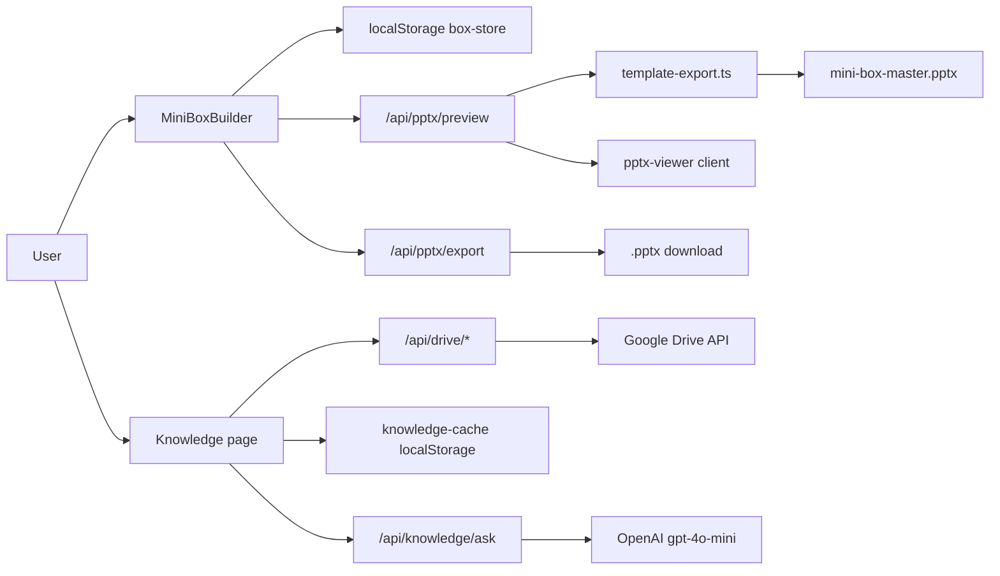

# Architecture

> Stable system structure. Update only when structure, data flow, or integrations change.

## Overview

**Box Studio (ciabv3)** is a Next.js 16 App Router app for building Living Security **Mini Box** content. Users ideate topics, edit section copy with optional AI assistance, preview a 7-slide PPTX live, and download a template-faithful deck. An optional **Knowledge Base** indexes Google Drive archives for Q&A. There is no server database — documents persist in browser `localStorage`.

**Stack:** Next.js 16.2.10, React 19, TypeScript 5, Tailwind CSS 4, next-auth v5 (Google OAuth), JSZip + fast-xml-parser (PPTX), pptx-viewer (preview), OpenAI + Giphy APIs.

## Major Components

| Component | Path | Responsibility |
|-----------|------|----------------|
| App Router pages | `src/app/` | Dashboard, builder, knowledge, settings, login |
| API routes | `src/app/api/` | Auth, AI, Giphy, PPTX, Drive, knowledge |
| Builder UI | `src/components/builder/` | Mini Box editor, preview, review, GIF picker |
| Layout shell | `src/components/layout/` | Sidebar, top bar, shell context |
| Document model | `src/lib/mini-box.ts` | Section types, status, factories |
| Box persistence | `src/lib/box-store.ts` | localStorage CRUD for boxes |
| PPTX export | `src/lib/pptx/template-export.ts` | Template XML surgery + GIF injection |
| Google Drive | `src/lib/google-drive.ts` | Folder browse, recursive indexing, text export |
| Knowledge cache | `src/lib/knowledge-cache.ts` | Indexed archive cache (localStorage) |
| Auth | `src/lib/auth.ts` | Google OAuth, token refresh callbacks |
| Master template | `templates/mini-box-master.pptx` | 7-slide Shadow AI deck source |

## Boundaries

- **In-app:** Mini Box authoring, PPTX preview/export, optional KB indexing and Q&A.
- **Out of app:** Google Slides editing (user uploads PPTX to Drive manually), email/chat distribution, analytics (sidebar placeholder only).
- **CIAB type:** Data model and empty factory exist; full workflow marked "Coming soon" on dashboard.

## Data Flow

## Integrations

| Service | Purpose | Interface |
|---------|---------|-----------|
| Google OAuth | Drive + Slides read for KB | `next-auth` provider in `src/lib/auth.ts` |
| Google Drive API | Folder browse, archive indexing | `src/lib/google-drive.ts`, `/api/drive/*` |
| OpenAI | Section generation, research, KB Q&A | `/api/ai/*`, `/api/knowledge/ask` |
| Giphy | GIF search for builder sections | `/api/giphy` |
| PPTX template | Preview and export source of truth | `templates/mini-box-master.pptx` |

All external APIs degrade to mock responses when keys are unset.

## Storage

| Layer | Mechanism | Keys / paths |
|-------|-----------|--------------|
| Box documents | Browser localStorage | `box-studio:boxes` |
| KB folder config | Browser localStorage | `box-studio:knowledge-folders` |
| KB index cache | Browser localStorage | `box-studio:knowledge-index:{type}:{folderId}` |
| UI preferences | Browser localStorage | `box-studio:sync-preview`, sidebar/section toggles |
| PPTX template | Server filesystem | `templates/mini-box-master.pptx` |

No server-side database or file store for user content.

## Authentication

- **Provider:** Google OAuth with `drive.readonly` and `presentations.readonly` scopes.
- **Session:** JWT with `accessToken`, `refreshToken`, `expiresAt` on session object.
- **Route protection:** No middleware. Builder and PPTX routes are public. Drive and knowledge API routes return 401 without a valid session token.
- **Optional login:** `/login` offers "Continue without Google" for builder-only use.

## Deployment

- **Platform:** Vercel (project `ciabv2`, Git-linked to `andrestaquechel/ciabv3`).
- **Production URL:** https://ciabv2-gilt.vercel.app
- **Trigger:** Auto-deploy on push to `main`.
- **CI:** GitHub Actions runs `npm ci` + `npm run build` on push/PR to `main` (`.github/workflows/ci.yml`).

## Testing Strategy

- **Unit / integration / e2e:** None configured. No test files in repo.
- **CI:** Build only (`npm run build`).
- **Lint:** `npm run lint` (eslint + eslint-config-next) — not in CI.
- **Manual:** Builder preview, PPTX download, Drive indexing in browser.

## Constraints

- Knowledge indexing capped at 250 files per folder scan.
- PPTX export uses fixed 7-slide template structure; slide/shape indices are hardcoded.
- All box data is per-browser localStorage — no cross-device sync.
- Next.js 16 has breaking API changes vs prior versions; consult `node_modules/next/dist/docs/` before modifying framework code.
